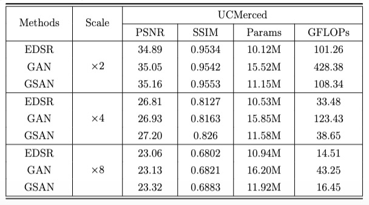
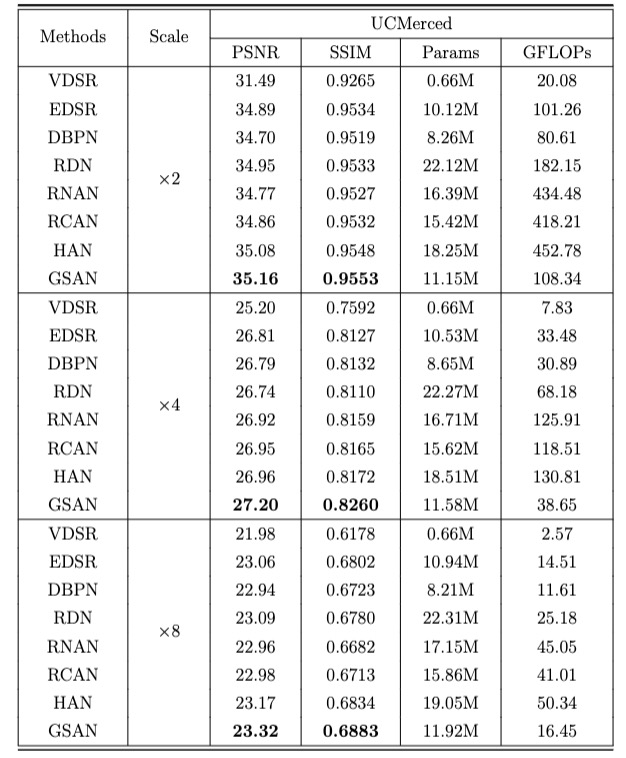
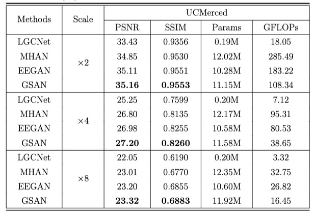
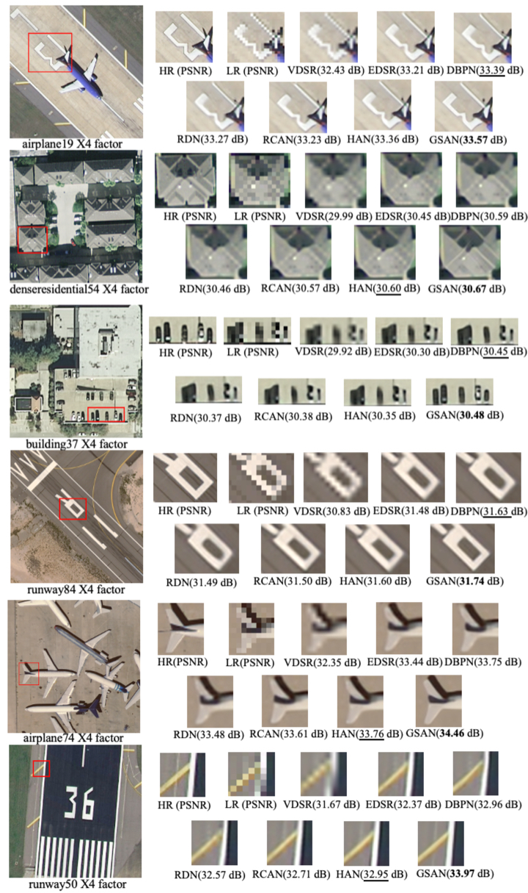
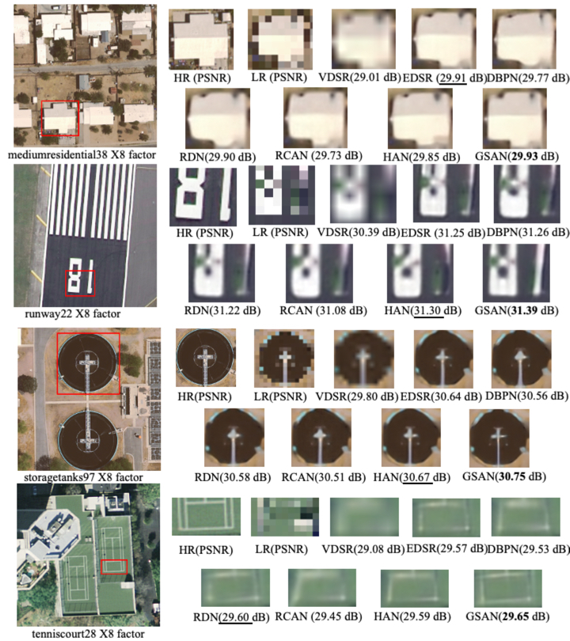
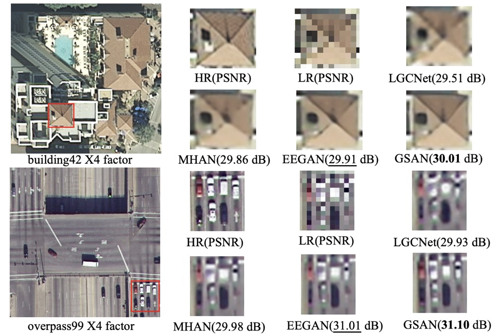

# Global Sparse Attention Network for Remote-Sensing Image Super-Resolution

This repository is for GSAN proposed in the paper "Global Sparse Attention Network for Remote-Sensing Image Super-Resolution".

The code is tested on Ubuntu 18.04 environment (Python3.6, PyTorch >= 1.1.0) with 3060Ti GPUs. 

## Contents
1. [Abstract](#abstract)
2. [Train](#train)
3. [Test](#test)
4. [Experiment](#experiment)

## Abstract

Recently, remote sensing images have become popular in various tasks, including resource exploration. However, limited
by hardware conditions and formation processes, the obtained remote sensing images often suffer from low-resolution
problems. Unlike the high cost of hardware to acquire high-resolution images, super-resolution software methods are
good alternatives for restoring low-resolution images. In addition, remote sensing images have a common nature that
similar visual patterns repeatedly appear across distant locations. To fully capture these long-range satellite image
contexts, we first introduce the global attention network super-resolution method to reconstruct the images. This
network improves the performance but introduces unessential information while significantly increasing the
computational effort. To address these problems, we propose an innovative method named the global sparse attention
network (GSAN) that integrates both sparsity constraints and global attention. Specifically, our method applies
spherical locality sensitive hashing (SLSH) to convert feature elements into hash codes, constructs attention groups
based on the hash codes, and computes the attention matrix according to similar elements in the attention group. Our
method captures valid and useful global information and reduces the computational effort from quadratic to
asymptotically linear regarding the spatial size. Extensive qualitative and quantitative experiments demonstrate that
our GSAN has significant competitive advantages in terms of performance and computational cost compared with other
state-of-the-art methods.

## Train
### training process 

1. Download AID training data (10000 images in total) from [AID dataset](https://www.kaggle.com/datasets/jiayuanchengala/aid-scene-classification-datasets).

2. Specify '--dir_data' based on the HR and LR images path. 

3. Cd to 'src', run the main.py to train models.

4. The backup of the trained neural models model_x2.pt, model_x4.pt, model_x8.pt files can be download from [Onedrive](https://1drv.ms/u/s!AvSB_AQ-mtJlgkGd9zv2glwcS521?e=SfHFlN) or [BadiuPan](https://pan.baidu.com/s/12uYw3qtEOqAYIzn7CyCJuQ) with extracted code "abcd".

## Test
### test process 

1. Download UCMerced test datasets (2100 images in total) from [UCMerced dataset](http://weegee.vision.ucmerced.edu/datasets/landuse.html)

2. Specify '--dir_data' based on the HR and LR images path and the the trained neural models path for scale factors of x2, x4 and x8.

3. Cd to 'src', run the main.py to test models and set the parameters '--data_test' and '--test_only'.

4. The results of the testing model are in the Experiments file.

## Experiment

### Comparative analysis of efficiency and performance on the UCMerced test dataset (×2, ×4, and ×8)

### Statistical evaluation of different methods on the UCMerced test dataset for scale factors of ×2, ×4, and ×8.

### Comparison of our method and three other remote sensing super-resolution methods on the UCMerced test dataset for scale factors of ×2, ×4, and ×8.

### Visual comparison of some representative SR methods and our method with a scale factor of ×4.

### Visual comparison of some representative SR methods and our method with a scale factor of ×8.

### Visual comparison of our method with three remote sensing super-resolution methods with a scale factor of ×4.

